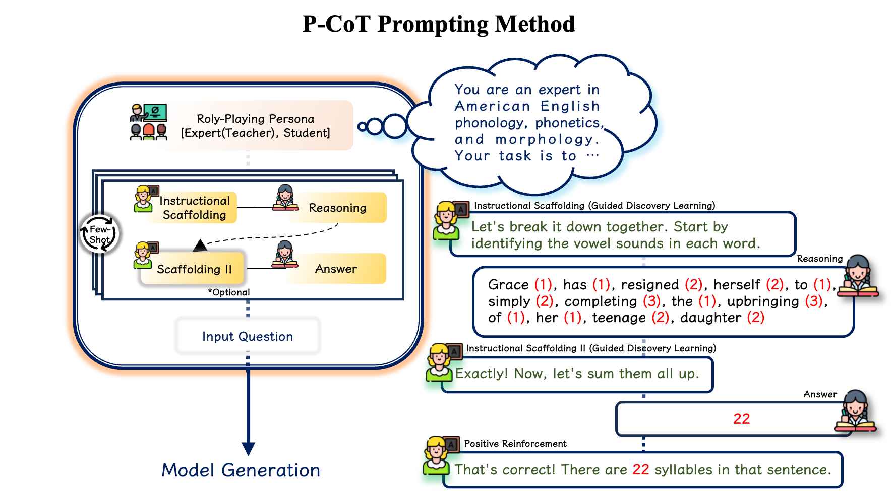

# P-CoT: A Pedagogically-motivated Participatory Chain-of-Thought Prompting for Phonological Reasoning in LLMs

<div align="center">



[](https://www.python.org/downloads/release/python-380/)
[](https://opensource.org/licenses/MIT)
[](https://arxiv.org/abs/2507.16656)

**Authors:** Dongjun Jang, Youngchae Ahn, Hyopil Shin  
*Department of Linguistics, Seoul National University*

</div>

## 🎯 Abstract

This study explores the potential of phonological reasoning within text-based large language models (LLMs). Utilizing the **PhonologyBench** benchmark, we assess tasks like **rhyme word generation**, **grapheme-to-phoneme (G2P) conversion**, and **syllable counting**. Our evaluations across **12 LLMs** reveal that while few-shot learning offers inconsistent gains, the introduction of a novel **Pedagogically-motivated Participatory Chain-of-Thought (P-CoT)** prompt, which is anchored in educational theories like **scaffolding** and **discovery learning**, consistently enhances performance. 

This method leverages structured guidance to activate latent phonological abilities, achieving **up to 52% improvement** and even **surpassing human baselines** in certain tasks. Our approach demonstrates that LLMs inherently encode phonological knowledge but lack effective strategies to leverage this information.

---

## 🚀 Key Contributions

- **🎓 Pedagogical Framework**: Novel P-CoT prompting inspired by scaffolding and discovery learning theories
- **📊 Comprehensive Evaluation**: Systematic assessment across 12 state-of-the-art LLMs (8 open-source, 4 closed)
- **🏆 Superior Performance**: Consistent improvements over baseline and few-shot methods across all phonological tasks
- **📈 Significant Gains**: Up to 52% improvement with performance surpassing human baselines
- **🔬 Statistical Validation**: Rigorous analysis with Mann-Whitney U tests confirming significance
- **🔄 Reproducible Research**: Complete codebase, datasets, and detailed experimental setup

---

## 📁 Repository Structure

```
P-CoT/
├── 📊 benchmark_dataset/          # PhonologyBench evaluation datasets
│   ├── g2p/                      # Grapheme-to-Phoneme conversion data
│   │   ├── g2p_high_frequency.json    # 2,084 high-frequency words
│   │   └── g2p_low_frequency.json     # 1,042 low-frequency words
│   ├── rhyme_word_generation/    # Rhyme generation benchmarks
│   │   ├── rhyme_common.csv           # 199 common words
│   │   └── rhyme_rare_fixed.csv       # 110 rare words
│   └── syllable_counting/        # Syllable counting evaluation
│       └── eval_sentence_counting.json # 993 sentences
│
├── 🧠 prompt_template/            # P-CoT prompt engineering templates
│   ├── G2P_conversion.ipynb     # G2P prompting strategies
│   ├── rhyme_word_generation.ipynb # Rhyme generation prompts
│   └── syllable_counting.ipynb  # Syllable counting prompts
│
├── 🔬 inference_code/            # Model inference implementations
│   ├── g2p_inference.py         # G2P conversion inference
│   ├── rhyme_inference.py       # Rhyme generation inference
│   └── syllable_inference.py    # Syllable counting inference
│
├── 📈 results/                   # Experimental results and analysis
│   ├── P-CoT1_results/          # Single-step P-CoT results
│   ├── P-CoT3_results/          # Three-step P-CoT results
│   └── P-CoT5_results/          # Five-step P-CoT results
│
├── 🔧 answer_extract/            # Result processing utilities
│   └── answer_extract.py        # Answer extraction and formatting
│
└── 📸 pedagogical6.png           # P-CoT framework visualization
```

---

## 🎯 Phonological Tasks

### 1. 🔤 Grapheme-to-Phoneme (G2P) Conversion
Transform written text into phonetic representations using IPA notation.

**Example:**
- Input: `"basement"`
- Output: `/beɪsmənt/`

**Dataset:** 3,126 words (2,084 high-frequency, 1,042 low-frequency)

### 2. 🎵 Rhyme Word Generation
Generate words that rhyme with given inputs, testing phonological pattern recognition.

**Example:**
- Input: `"education"`
- Output: `["circulation", "occupation", "reputation", "population", "reservation"]`

**Dataset:** 309 words (199 common, 110 rare) with ~1,200 rhyming candidates each

### 3. 📊 Syllable Counting
Accurately count syllables in sentences for prosodic analysis.

**Example:**
- Input: `"To top it all off, I miss my stunner."`
- Output: `10 syllables`

**Dataset:** 993 sentences with varying complexity

---

## 🧪 P-CoT Methodology

### Theoretical Foundation

Our **Pedagogically-motivated Participatory Chain-of-Thought (P-CoT)** approach integrates:

1. **🎓 Discovery Learning** (Bruner, 1961): Learners explore core principles through inquiry-based methods
2. **🏗️ Scaffolding** (Wood et al., 1976): Structured guidance within Vygotsky's Zone of Proximal Development
3. **👥 Role-Playing Pedagogy**: Teacher-student interaction simulation
4. **🔄 Guided Exploration**: Preventing misconceptions through structured support

### P-CoT Configurations

- **P-CoT1**: Single teacher-student interaction with one example
- **P-CoT3**: Three structured interactions maintaining dialogic format  
- **P-CoT5**: Five interactions reinforcing concepts through guided discovery

### Prompt Structure

```
1. Role Assignment: Teacher and student personas
2. Conceptual Introduction: Task definitions and principles
3. Scaffolded Examples: Step-by-step problem decomposition
4. Guided Discovery: Interactive learning through structured dialogue
5. Task Application: Target problem solving with learned strategies
```

---

## 📊 Experimental Setup

### Models Evaluated

**Open-Source Models (8):**
- Meta LLaMA: Llama-3.3-70B, Llama-3.1-8B
- Mistral: Mistral-7B, Ministral-8B  
- Qwen: Qwen2.5-72B, Qwen2.5-7B
- Google Gemma: gemma-2-9b, gemma-2-27b

**Closed Models (4):**
- OpenAI: GPT-3.5-turbo, GPT-4o
- Anthropic: Claude 3.5 Sonnet, Claude 3.5 Haiku

### Evaluation Metrics

- **G2P & Syllable Counting**: Exact Match accuracy
- **Rhyme Generation**: Success Rate (proportion of correct rhymes in generated set)
- **Statistical Testing**: Mann-Whitney U tests for significance validation

---

## 🏆 Key Results

### Performance Comparison Summary

| Task | Baseline | 3-Shot | 5-Shot | **P-CoT1** | **P-CoT3** | **P-CoT5** |
|------|----------|--------|--------|------------|------------|------------|
| **G2P (High-freq)** | 51.6% | 79.3% | 79.8% | 80.4% | 81.3% | **82.2%** |
| **G2P (Low-freq)** | 35.5% | 57.2% | 57.0% | 59.9% | 61.0% | **61.6%** |
| **Rhyme (Common)** | 76.4% | 76.9% | 77.3% | 82.5% | 83.1% | **83.2%** |
| **Rhyme (Rare)** | 38.2% | 36.7% | 37.1% | 50.8% | **53.3%** | 51.2% |
| **Syllable Count** | 20.2% | 24.8% | **32.9%** | 23.4% | 28.8% | 32.6% |

*Results from Claude 3.5 Sonnet (representative high-performing model)*

### Statistical Significance

**G2P Conversion (Mann-Whitney U Test p-values):**
- Baseline vs P-CoT (High-freq): p = 5.72 × 10⁻⁶ ✓
- Baseline vs P-CoT (Low-freq): p = 6.44 × 10⁻¹² ✓
- Few-shot vs P-CoT (High-freq): p = 1.84 × 10⁻² ✓

### Notable Achievements

- **🎯 Mistral-7B**: 52 percentage point improvement in rhyme generation (26.8% → 78.8% for common words)
- **🏆 Human Baseline**: P-CoT surpassed human performance in specific tasks (Human: 86.4/60.4 for rhyme tasks)
- **📈 Consistency**: P-CoT showed improvements across ALL 12 evaluated models
- **🔍 Error Reduction**: 25% reduction in high-error categories for syllable counting (32.7% → 24.3%)

---

## 🛠️ Quick Start

### Prerequisites

```bash
pip install torch transformers pandas tqdm numpy
```

### Running Experiments

#### G2P Conversion
```bash
cd inference_code
python g2p_inference.py --model_id "meta-llama/Llama-3.3-70B-Instruct" --token "your_hf_token"
```

#### Rhyme Generation
```bash
python rhyme_inference.py --model_id "anthropic/claude-3-5-sonnet" --token "your_api_key"
```

#### Syllable Counting
```bash
python syllable_inference.py --model_id "mistralai/Mistral-7B-Instruct-v0.2" --token "your_hf_token"
```

### Custom P-CoT Implementation

```python
# Example P-CoT prompt structure for G2P conversion
messages = [
    {"role": "system", "content": "You are an expert phonologist teacher..."},
    {"role": "user", "content": "I'm ready to learn about G2P conversion..."},
    {"role": "assistant", "content": "Let's explore how 'cat' becomes /kæt/..."},
    {"role": "user", "content": "Now convert 'basement' to phonemes..."}
]
```

---

## 📈 Detailed Analysis

### Complexity Analysis

**G2P Conversion Performance by Word Complexity:**
- Complexity Score: S = 0.4L + 0.3V + 0.3C (Length + Vowels + Consonants)
- P-CoT maintains superior performance across all complexity ranges
- Performance gap becomes more pronounced at higher complexity levels
- Demonstrates robust capability for handling intricate G2P conversion tasks

### Error Pattern Analysis

**Syllable Counting Error Distribution:**
- Baseline: 32.67% high-error cases (4+ syllable errors)
- P-CoT5: 24.33% high-error cases (significant reduction)
- P-CoT enables better interpretation of syllabic structure
- Reduction in high-error categories demonstrates deeper phonological understanding

### Rhyme Generation Success Rates

**Threshold Analysis (0.0 to 1.0 success rates):**
- P-CoT shows consistent positive improvements at 1.0 threshold for both common and rare words
- Few-shot methods show instability and often fall below baseline at higher thresholds
- P-CoT demonstrates superior reliability and consistency across word categories

---

## 🔬 Research Implications

### Theoretical Contributions

1. **Latent Phonological Knowledge**: LLMs encode substantial phonological patterns but lack effective access strategies
2. **Educational Theory Application**: Scaffolding and discovery learning principles successfully transfer to LLM prompting
3. **Structured Reasoning**: Pedagogical frameworks unlock hidden capabilities through guided exploration

### Practical Applications

- **Speech Synthesis**: Enhanced G2P conversion for TTS systems
- **Language Learning**: Phonological awareness training tools
- **Linguistic Research**: Automated phonological analysis pipelines
- **Multilingual Systems**: Cross-linguistic phonological processing

---

## 🚀 Future Directions

- **Model-Specific Optimization**: Tailored P-CoT prompts for different architectures
- **Cross-Linguistic Extension**: Application to non-English phonological systems
- **Multimodal Integration**: Combining text-based and audio-based phonological reasoning
- **Real-time Applications**: Optimized P-CoT for production environments

---

## 📚 Citation
To Appear ACL2025 Findings

---

## 🤝 Contributing

We welcome contributions to advance phonological reasoning in LLMs:

- 🐛 **Bug Reports**: Issues with inference code or datasets
- 📝 **Documentation**: Improvements to setup and usage guides  
- 🔬 **New Experiments**: Additional model evaluations or task extensions
- 🛠️ **Code Enhancements**: Performance optimizations and new features
- 📊 **Analysis Tools**: Visualization and statistical analysis utilities


---

## 🙏 Acknowledgments

- **PhonologyBench**: Foundation benchmark by Suvarna et al. (2024)
- **Educational Theory**: Inspired by works of Bruner, Wood, Vygotsky, and Collins
- **Open Source Community**: Built on excellent transformer and ML libraries
- **Seoul National University**: Computational resources and research support

---

<div align="center">

**🌟 Star this repository if you find our research helpful! 🌟**

For questions or collaborations, contact: `{qwer4107, estelle1026, hpshin}@snu.ac.kr`

[📧 Contact](mailto:qwer4107@snu.ac.kr)

</div>
